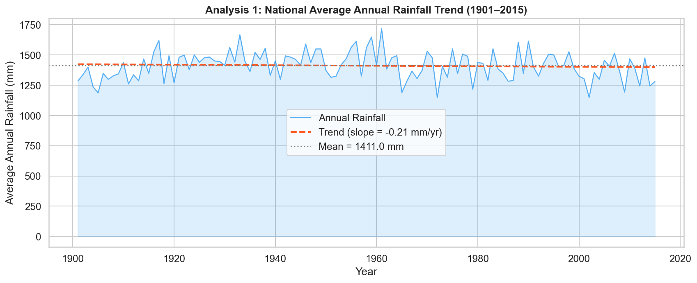
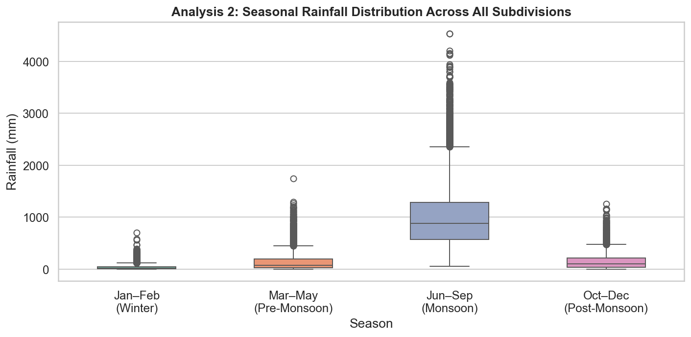
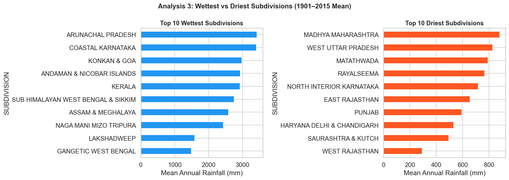
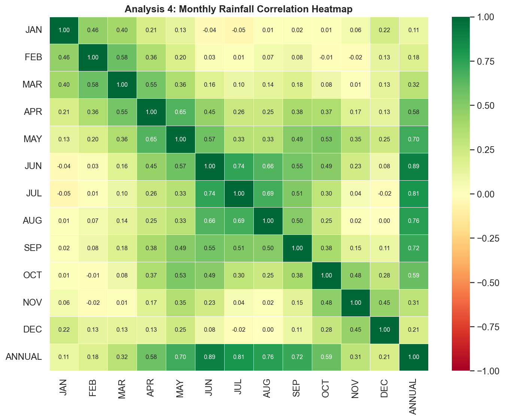

# 🌧️ India Rainfall Analysis & Prediction (1901–2015)

## 📌 Overview

This project performs a comprehensive analysis of India's subdivision-wise rainfall data (1901–2015) and builds a Machine Learning model to predict annual rainfall using monsoon data (JJAS).

---

## 🎯 Objectives

* Analyze long-term rainfall trends across India
* Compare seasonal rainfall distribution
* Identify wettest and driest regions
* Understand monthly contribution to annual rainfall
* Build a predictive ML model

---

## 📊 Key Insights

* Monsoon season (JJAS) contributes the majority of annual rainfall
* Strong correlation between monsoon months and total rainfall
* Significant regional variation across subdivisions

---

## 🤖 Machine Learning Model

* Model: Linear Regression
* Input: JJAS Rainfall
* Output: Annual Rainfall

### 📈 Performance

* **R² Score:** 0.888 (~88.8% accuracy)
* **MSE:** 0.0024
* **MAE:** 0.0373

---

## 📷 Visualizations

### 📈 Trend Analysis


*Shows long-term rainfall trend across India with a slight declining pattern over the years.*

---

### 📊 Seasonal Distribution


*Indicates that monsoon (JJAS) contributes the highest rainfall, with significant variability compared to other seasons.*

---

### 🌍 Wet vs Dry Regions


*Highlights strong regional disparities, with northeastern and coastal regions receiving the highest rainfall while central and western regions are drier.*

---

### 🔥 Correlation Heatmap


*Shows strong positive correlation between monsoon months (Jun–Sep) and annual rainfall, confirming their major influence.*

---

### 🤖 ML Prediction


*Demonstrates a strong linear relationship between JJAS and annual rainfall, with good model fit and low prediction error.*


## 🛠️ Tech Stack

* Python
* Pandas, NumPy
* Matplotlib, Seaborn
* Scikit-learn

---

## 🚀 How to Run

```bash
pip install pandas numpy matplotlib seaborn scikit-learn
python rainfall_analysis.py
```

---

## 📁 Dataset

India Subdivision Rainfall Dataset (1901–2015)

Source: [Data.gov.in](https://www.data.gov.in/resource/subdivision-wise-rainfall-and-its-departure-1901-2015)

---

## 🔮 Future Scope

* Use advanced ML models (Random Forest, XGBoost)
* Add external climate factors
* Build interactive dashboard (Power BI / Streamlit)

---

## 💡 Conclusion

Monsoon rainfall is a strong predictor of annual rainfall, making it a key factor in climate analysis and forecasting.
